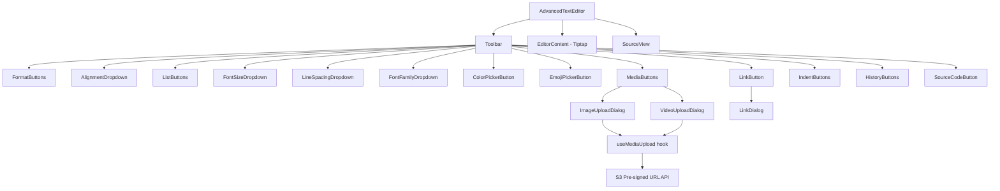
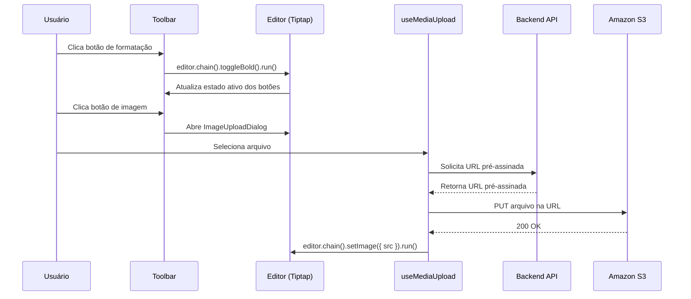

# Documento de Design — Editor de Texto Avançado

## Visão Geral

Este documento descreve o design técnico para a POC de um Editor de Texto Avançado baseado no Tiptap, implementado como um componente React autônomo com TypeScript e Vite. O editor oferece formatação rica de texto, inserção de mídia via URLs pré-assinadas do S3, e uma toolbar completa com controles visuais.

A arquitetura segue o modelo de extensões do Tiptap, onde cada funcionalidade (negrito, listas, mídia, etc.) é uma extensão independente registrada no editor. O componente principal (`AdvancedTextEditor`) encapsula toda a lógica e pode ser importado e utilizado de forma independente em qualquer projeto React.

### Decisões de Design

- **Tiptap como core**: O Tiptap é construído sobre o ProseMirror e oferece uma API declarativa de extensões que mapeia diretamente para os requisitos de formatação. Cada funcionalidade da toolbar corresponde a uma extensão Tiptap.
- **Componente autônomo**: O editor é um único componente React com props de configuração, sem dependência de estado global externo.
- **Upload via S3 pré-assinado**: Mídia é enviada diretamente do browser para o S3, sem passar pelo backend para o upload em si — apenas a obtenção da URL pré-assinada requer chamada ao backend.
- **Sem barrel files**: Seguindo as regras do workspace, cada componente exporta diretamente via `export default`.

## Arquitetura

### Diagrama de Componentes



### Fluxo de Dados



### Extensões Tiptap Necessárias

| Extensão | Pacote | Requisito |
|----------|--------|-----------|
| StarterKit | `@tiptap/starter-kit` | Req 3, 5, 14 (bold, italic, listas, history) |
| Underline | `@tiptap/extension-underline` | Req 3.3 |
| TextAlign | `@tiptap/extension-text-align` | Req 4 |
| TextStyle | `@tiptap/extension-text-style` | Req 7, 9, 18 (base para font-size, color, font-family) |
| Color | `@tiptap/extension-color` | Req 9.1, 9.2 |
| Highlight | `@tiptap/extension-highlight` | Req 9.3, 9.4 (background color) |
| FontFamily | `@tiptap/extension-font-family` | Req 18 |
| Link | `@tiptap/extension-link` | Req 10 |
| Image | `@tiptap/extension-image` | Req 11 |
| Placeholder | `@tiptap/extension-placeholder` | Req 2 (campo opcional) |
| **Custom: FontSize** | Extensão customizada | Req 7 (font-size via TextStyle) |
| **Custom: LineSpacing** | Extensão customizada | Req 8 (line-height em parágrafos) |
| **Custom: Indent** | Extensão customizada | Req 6 (margin-left em parágrafos) |
| **Custom: Video** | Extensão customizada | Req 12 (node de vídeo) |

**Nota sobre StarterKit**: O `@tiptap/starter-kit` inclui Bold, Italic, Strike, BulletList, OrderedList, History, entre outros. Será configurado para desabilitar extensões não necessárias.

## Componentes e Interfaces

### Estrutura de Arquivos

```
src/
├── App.tsx
├── main.tsx
├── components/
│   └── AdvancedTextEditor/
│       ├── AdvancedTextEditor.tsx          (componente principal)
│       ├── Toolbar.tsx                      (barra de ferramentas)
│       ├── SourceView.tsx                   (visualização HTML)
│       ├── FormatButtons.tsx                (B, I, U, S, clear)
│       ├── AlignmentDropdown.tsx            (alinhamento)
│       ├── ListButtons.tsx                  (listas)
│       ├── FontSizeDropdown.tsx             (tamanho de fonte)
│       ├── FontFamilyDropdown.tsx           (família de fonte)
│       ├── LineSpacingDropdown.tsx           (espaçamento)
│       ├── ColorPickerButton.tsx            (cor texto/fundo)
│       ├── EmojiPickerButton.tsx            (emoji)
│       ├── LinkButton.tsx                   (link)
│       ├── LinkDialog.tsx                   (dialog de link)
│       ├── MediaButtons.tsx                 (imagem/vídeo)
│       ├── MediaUploadDialog.tsx            (dialog de upload)
│       ├── IndentButtons.tsx                (recuo)
│       ├── HistoryButtons.tsx               (undo/redo)
│       ├── SourceCodeButton.tsx             (toggle source)
│       ├── AdvancedTextEditor.css            (estilos)
│       └── types.ts                         (tipos compartilhados)
├── extensions/
│   ├── FontSize.ts                          (extensão custom font-size)
│   ├── LineSpacing.ts                       (extensão custom line-spacing)
│   ├── Indent.ts                            (extensão custom indent)
│   └── Video.ts                             (extensão custom vídeo node)
├── hooks/
│   └── useMediaUpload.ts                    (hook de upload S3)
└── services/
    └── mediaService.ts                      (API de URLs pré-assinadas)
```

### Interface Principal

```typescript
interface AdvancedTextEditorProps {
  initialContent?: string
  onChange?: (html: string) => void
  presignedUrlEndpoint?: string
  placeholder?: string
  editable?: boolean
}
```

### Componente AdvancedTextEditor

O componente raiz instancia o editor Tiptap com todas as extensões, gerencia o estado de visualização (rich text vs source code), e passa a instância do editor para a Toolbar e o EditorContent.

```typescript
function AdvancedTextEditor({
  initialContent = '',
  onChange,
  presignedUrlEndpoint,
  placeholder,
  editable = true,
}: AdvancedTextEditorProps): JSX.Element
```

Internamente usa `useEditor` do `@tiptap/react` com todas as extensões configuradas. O estado `isSourceView` controla a alternância entre o modo rich text e o modo de código-fonte.

### Toolbar

Recebe a instância `editor` do Tiptap e renderiza todos os grupos de botões. Cada sub-componente da toolbar usa `editor.isActive()` para refletir o estado ativo e `editor.chain()` para executar comandos.

```typescript
interface ToolbarProps {
  editor: Editor | null
  onToggleSource: () => void
  isSourceView: boolean
  presignedUrlEndpoint?: string
}
```

### Hook useMediaUpload

```typescript
interface UseMediaUploadReturn {
  upload: (file: File) => Promise<string>
  isUploading: boolean
  error: string | null
  progress: number
}

function useMediaUpload(presignedUrlEndpoint: string): UseMediaUploadReturn
```

Fluxo:
1. Recebe o `File` selecionado pelo usuário
2. Faz `POST` ao `presignedUrlEndpoint` com `{ fileName, contentType }` para obter a URL pré-assinada e a URL final do recurso
3. Faz `PUT` do arquivo diretamente na URL pré-assinada do S3
4. Retorna a URL final do recurso para inserção no editor

### SourceView

```typescript
interface SourceViewProps {
  html: string
  onSave: (html: string) => void
  onCancel: () => void
}
```

Exibe um `<textarea>` com o HTML bruto. Ao confirmar, o HTML editado é passado de volta ao editor via `editor.commands.setContent()`.

### Extensões Customizadas

**FontSize** — Extensão do tipo `Mark` que estende `TextStyle` para adicionar `font-size` como atributo inline:
- Comando: `setFontSize(size: string)`
- Armazena como `style="font-size: 14px"` no span do TextStyle

**LineSpacing** — Extensão do tipo `Extension` que adiciona `lineHeight` como atributo de nó em parágrafos:
- Comando: `setLineSpacing(value: string)`
- Armazena como `style="line-height: 1.5"` no elemento `<p>`

**Indent** — Extensão do tipo `Extension` que adiciona `marginLeft` como atributo de nó em parágrafos:
- Comandos: `indent()`, `outdent()`
- Incrementa/decrementa `margin-left` em passos de 40px
- Mínimo: 0px

**Video** — Extensão do tipo `Node` que renderiza um elemento `<video>`:
- Atributos: `src`, `controls` (default true), `width`
- Renderiza como `<video src="..." controls width="100%"></video>`

## Modelos de Dados

### Estado do Editor

O Tiptap gerencia internamente o estado do documento como um `ProseMirror Document` (árvore de nós). O estado relevante para a aplicação:

```typescript
interface EditorState {
  content: string          // HTML serializado do conteúdo
  isSourceView: boolean    // modo de visualização atual
  isEditable: boolean      // se o editor aceita input
}
```

### Modelo de Upload de Mídia

```typescript
interface PresignedUrlRequest {
  fileName: string
  contentType: string
  mediaType: 'image' | 'video'
}

interface PresignedUrlResponse {
  uploadUrl: string        // URL pré-assinada para PUT
  resourceUrl: string      // URL final do recurso no S3
}

interface UploadState {
  isUploading: boolean
  progress: number         // 0-100
  error: string | null
}
```

### Modelo de Configuração de Extensões

```typescript
interface FontSizeConfig {
  sizes: string[]          // ['8', '9', '10', '11', '12', '14', '18', '24', '36']
  defaultSize: string      // '14'
}

interface LineSpacingConfig {
  values: string[]         // ['1.0', '1.2', '1.4', '1.5', '1.6', '1.8', '2.0', '3.0']
  defaultValue: string     // '1.5'
}

interface IndentConfig {
  step: number             // 40 (px)
  maxLevel: number         // 10
}

interface FontFamilyConfig {
  families: string[]       // ['Graphik', 'Arial', 'Times New Roman', ...]
  defaultFamily: string    // 'Graphik'
}
```

## Propriedades de Corretude

*Uma propriedade é uma característica ou comportamento que deve ser verdadeiro em todas as execuções válidas de um sistema — essencialmente, uma declaração formal sobre o que o sistema deve fazer. Propriedades servem como ponte entre especificações legíveis por humanos e garantias de corretude verificáveis por máquina.*

### Propriedade 1: Toggle de formatação é involutivo

*Para qualquer* marca de formatação (bold, italic, underline, strikethrough) e qualquer texto selecionado, aplicar o toggle duas vezes consecutivas deve retornar o conteúdo ao estado original (sem a marca).

**Valida: Requisitos 3.1, 3.2, 3.3, 3.4**

### Propriedade 2: Limpar formatação remove todas as marcas

*Para qualquer* conteúdo do editor com uma combinação arbitrária de marcas de formatação (bold, italic, underline, strikethrough, cor, font-size, font-family), executar "clear all formatting" deve resultar em texto sem nenhuma marca aplicada.

**Valida: Requisitos 3.5, 3.6**

### Propriedade 3: Alinhamento aplicado é refletido no parágrafo

*Para qualquer* valor de alinhamento válido (left, center, right, justify) e qualquer parágrafo, aplicar o alinhamento deve resultar no parágrafo reportando aquele alinhamento como ativo.

**Valida: Requisitos 4.1, 4.2, 4.3, 4.4**

### Propriedade 4: Toggle de lista é involutivo

*Para qualquer* tipo de lista (bullet ou ordered) e qualquer conteúdo de texto, aplicar o toggle de lista duas vezes deve retornar o conteúdo ao estado original (sem lista).

**Valida: Requisitos 5.1, 5.2**

### Propriedade 5: Indent e outdent são operações inversas

*Para qualquer* parágrafo com nível de indentação N (onde N > 0), aplicar indent seguido de outdent deve retornar ao nível N. Simetricamente, outdent seguido de indent em nível N (onde N < max) deve retornar ao nível N.

**Valida: Requisitos 6.1, 6.2**

### Propriedade 6: Outdent no nível zero é idempotente

*Para qualquer* parágrafo com nível de indentação 0, aplicar outdent deve manter o nível em 0 (não pode ficar negativo).

**Valida: Requisito 6.2**

### Propriedade 7: Atributos de estilo de texto são aplicados corretamente

*Para qualquer* valor válido de font-size (do conjunto {8,9,10,11,12,14,18,24,36}), font-family (do conjunto configurado), ou line-spacing (do conjunto {1.0,1.2,1.4,1.5,1.6,1.8,2.0,3.0}), aplicar o valor ao texto/parágrafo deve resultar no conteúdo refletindo aquele atributo de estilo.

**Valida: Requisitos 7.2, 8.2, 18.2**

### Propriedade 8: Cores são aplicadas ao texto

*Para qualquer* cor válida (representada como string hex), aplicar como cor de texto deve resultar no texto tendo aquela cor, e aplicar como cor de fundo deve resultar no texto tendo aquele highlight.

**Valida: Requisitos 9.2, 9.4**

### Propriedade 9: Link aplicado preserva URL

*Para qualquer* URL válida e qualquer texto selecionado, aplicar o link deve resultar no texto contendo um link com exatamente aquela URL como atributo href.

**Valida: Requisito 10.2**

### Propriedade 10: Upload de mídia solicita URL pré-assinada

*Para qualquer* arquivo (imagem ou vídeo) com fileName e contentType válidos, o hook useMediaUpload deve fazer uma requisição ao endpoint configurado com os dados do arquivo antes de tentar o upload.

**Valida: Requisitos 11.2, 12.2**

### Propriedade 11: Upload de mídia envia arquivo para S3

*Para qualquer* URL pré-assinada válida retornada pelo backend e qualquer arquivo, o hook useMediaUpload deve executar um PUT do conteúdo do arquivo para a URL pré-assinada.

**Valida: Requisitos 11.3, 12.3**

### Propriedade 12: Mídia inserida após upload bem-sucedido

*Para qualquer* upload de mídia bem-sucedido (imagem ou vídeo), o editor deve conter um nó de mídia correspondente (image ou video) com o atributo src igual à resourceUrl retornada.

**Valida: Requisitos 11.4, 12.4**

### Propriedade 13: Round-trip do Source View

*Para qualquer* conteúdo válido do editor, obter o HTML via getHTML(), exibir no Source View, e confirmar sem alterações deve resultar em conteúdo equivalente ao original.

**Valida: Requisitos 13.1, 13.2**

### Propriedade 14: Undo/Redo é round-trip

*Para qualquer* ação realizada no editor (inserção de texto, formatação, etc.), executar undo seguido de redo deve retornar o editor ao estado após a ação original.

**Valida: Requisitos 14.1, 14.2**

### Propriedade 15: Estado ativo da toolbar reflete formatação

*Para qualquer* marca de formatação aplicada ao texto na posição do cursor, o método `editor.isActive()` para aquela marca deve retornar `true`. Quando a marca não está aplicada, deve retornar `false`.

**Valida: Requisito 15.2**

### Propriedade 16: Emoji inserido aparece no conteúdo

*Para qualquer* caractere emoji válido, inserir no editor deve resultar no conteúdo do editor contendo aquele emoji.

**Valida: Requisito 16.2**

### Propriedade 17: Callback onChange é invocado com HTML atualizado

*Para qualquer* alteração de conteúdo no editor (inserção, formatação, deleção), o callback `onChange` deve ser chamado com uma string HTML que representa o estado atual do editor.

**Valida: Requisito 17.3**

### Propriedade 18: Editor aceita conteúdo de tamanho arbitrário

*Para qualquer* string de texto com comprimento N (onde N é arbitrariamente grande), o editor deve aceitar e armazenar o conteúdo sem truncar ou rejeitar.

**Valida: Requisito 2.3**

## Tratamento de Erros

### Erros de Upload de Mídia

- **Falha na obtenção da URL pré-assinada**: O hook `useMediaUpload` define `error` com mensagem descritiva e `isUploading` como `false`. O dialog exibe a mensagem de erro ao usuário. (Requisitos 11.5, 12.5)
- **Falha no upload para S3**: Mesmo tratamento — erro capturado, estado atualizado, mensagem exibida.
- **Timeout de rede**: Tratado como falha de upload com mensagem específica de timeout.
- **Tipo de arquivo inválido**: Validação no dialog antes de iniciar o upload. Arquivos não suportados são rejeitados com mensagem.

### Erros do Editor

- **HTML inválido no Source View**: O Tiptap sanitiza HTML automaticamente via ProseMirror schema. HTML malformado é corrigido silenciosamente ao ser parseado.
- **Extensão não carregada**: Se uma extensão falhar ao carregar, o editor funciona sem aquela funcionalidade. Botões correspondentes ficam desabilitados.

### Erros de Rede

- **Backend indisponível**: O hook de upload captura erros de rede e expõe via estado `error`. O componente exibe feedback visual.

## Estratégia de Testes

### Abordagem Dual

A estratégia de testes combina testes unitários e testes baseados em propriedades para cobertura abrangente.

### Testes Unitários

Focam em exemplos específicos, edge cases e condições de erro:

- **Renderização da Toolbar**: Verificar que todos os botões listados no Requisito 15.1 estão presentes
- **Opções de dropdowns**: Verificar que font-size (Req 7.1), line-spacing (Req 8.1), e font-family (Req 18.1) exibem as opções corretas
- **Estado inicial**: Editor vazio é válido (Req 2.1), undo/redo desabilitados (Req 14.3, 14.4)
- **Transição Source View**: Alternar para source view e voltar mantém o modo correto (Req 13.3)
- **Erro de upload**: Simular falha de rede e verificar que o estado de erro é definido (Req 11.5, 12.5)
- **Emoji picker**: Abrir e fechar o picker (Req 16.1, 16.3)
- **Link dialog**: Abrir dialog com CTRL+K (Req 10.1), editar/remover link existente (Req 10.3)

### Testes Baseados em Propriedades

Cada propriedade de corretude definida acima será implementada como um teste de propriedade individual usando a biblioteca **fast-check** (`fc`).

- **Biblioteca**: `fast-check` (https://github.com/dubzzz/fast-check)
- **Iterações mínimas**: 100 por teste de propriedade
- **Framework de teste**: Vitest
- **Cada teste deve referenciar a propriedade do design**:
  - Formato do tag: `Feature: advanced-text-editor, Property {número}: {título}`

Exemplo de estrutura de teste:

```typescript
// Feature: advanced-text-editor, Property 1: Toggle de formatação é involutivo
test.prop(
  [fc.constantFrom('bold', 'italic', 'underline', 'strike'), fc.string({ minLength: 1 })],
  ([mark, text]) => {
    // setup editor with text, select all, toggle mark twice
    // assert content equals original
  },
  { numRuns: 100 }
)
```

### Organização dos Testes

```
src/
├── __tests__/
│   ├── properties/
│   │   ├── formatting.property.test.ts      (Props 1, 2, 7, 8, 15)
│   │   ├── alignment.property.test.ts       (Prop 3)
│   │   ├── lists.property.test.ts           (Prop 4)
│   │   ├── indentation.property.test.ts     (Props 5, 6)
│   │   ├── media.property.test.ts           (Props 10, 11, 12)
│   │   ├── sourceView.property.test.ts      (Prop 13)
│   │   ├── history.property.test.ts         (Prop 14)
│   │   ├── editor.property.test.ts          (Props 16, 17, 18)
│   │   └── link.property.test.ts            (Prop 9)
│   └── unit/
│       ├── Toolbar.test.ts
│       ├── SourceView.test.ts
│       ├── useMediaUpload.test.ts
│       └── AdvancedTextEditor.test.ts
```
